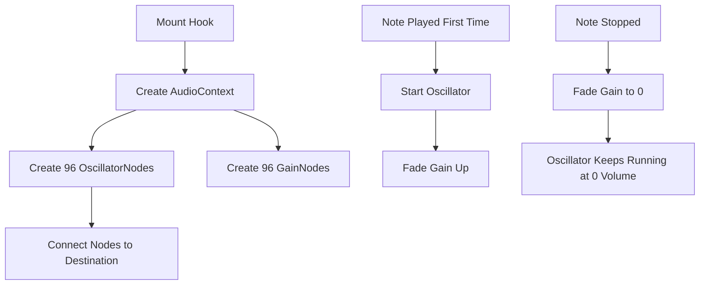
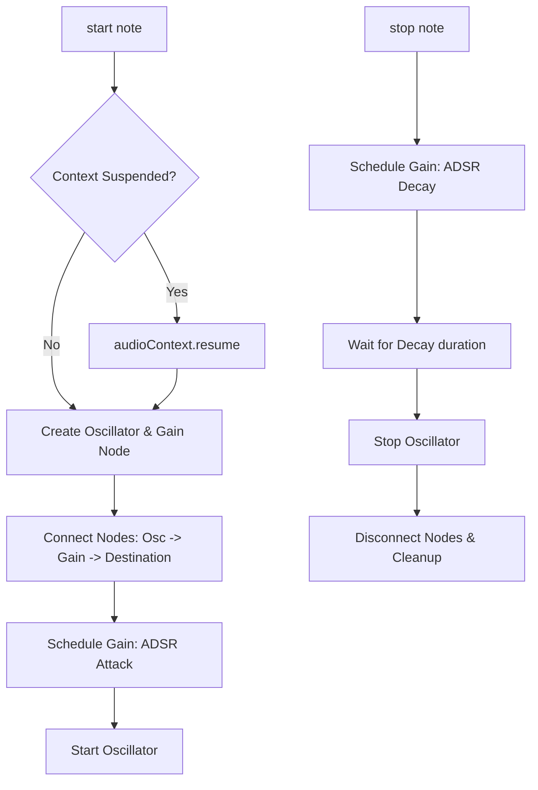

# Web Audio API Lifecycle & React Hooks Integration

This guide provides architectural context for the React hooks and Web Audio API integration in `useMusicNotes.ts` and `Piano.tsx`. It documents the current performance bottlenecks, memory leak paths, and the blueprint for refactoring to a standard dynamic voice allocation system.

---

## 1. The React + Web Audio Lifecycle Challenge

React's rendering cycle operates on state updates, re-renders, and component mounts/unmounts. The Web Audio API operates on a separate, low-level DSP graph where audio nodes must be instantiated, connected, scheduled, and released. Combining the two requires precise boundary management:

1. **Context Reuse:** Creating an `AudioContext` is expensive. There should be a single, stable context lifecycle.
2. **Autoplay Policies:** Browsers prevent audio playback until a user gesture occurs. `AudioContext` instances start in a `suspended` state.
3. **Node Lifetime:** Oscillators are single-use objects. Once they are started and stopped, they cannot be restarted. Keeping them running continuously is extremely wasteful.

---

## 2. Current Architecture & Bottlenecks



### Identified Failures:
1. **Memory Leak (AudioContext):** 
   - `Piano.tsx` instantiates `AudioContext` inside its render function (not a hook or effect) when `showWaveform` is active.
   - It is passed down as a prop, meaning `useMusicNotes` will not clean it up (assuming it's managed by the parent).
   - `Piano.tsx` has no cleanup logic. Every unmount of `Piano` leaves an orphaned `AudioContext` running in the browser.
2. **CPU Exhaustion (96 Oscillators):**
   - 96 oscillators and 96 gain nodes are instantiated immediately on mount.
   - On keypress, the oscillator starts. On key release, the gain is set to 0, but the oscillator is never stopped.
   - All played notes remain active in the background, consuming CPU resources indefinitely.
3. **Muted Playback (Autoplay Policy):**
   - `.resume()` is only called in a `useEffect` on mount.
   - Because no user gesture has occurred yet, the browser blocks the resume, keeping the context suspended.
   - `start(note)` does not check for or trigger `.resume()`, causing the piano to stay muted until a browser event resumes the context.

---

## 3. Recommended Refactored Architecture

To resolve all leaks, performance bottlenecks, and autoplay issues, the synthesizer should be refactored to use a **dynamic voice allocation** system.



### 1. Dynamic Node Creation
Instead of pre-creating 96 nodes, maintain a map of active voices in a `useRef`:
```typescript
type ActiveVoice = {
  oscillatorNode: OscillatorNode;
  gainNode: GainNode;
};

// Map of note name to active voice nodes
const activeVoicesRef = useRef<Record<string, ActiveVoice>>({});
```

### 2. Implementation of `start()` and `stop()`
When `start(note)` is triggered:
1. **Resume Context:** If `ctx.state === "suspended"`, call `ctx.resume()`.
2. **Check Duplicate:** If the note is already playing, stop it first to prevent overlapping duplicates.
3. **Create Nodes:**
   ```typescript
   const oscNode = ctx.createOscillator();
   const gainNode = ctx.createGain();
   
   oscNode.type = oscillatorType;
   oscNode.frequency.value = noteFrequency;
   ```
4. **Connect Graph:** Connect `oscNode` to `gainNode`, and connect `gainNode` to `ctx.destination` (and optional analyser).
5. **Schedule Envelope (Attack):**
   ```typescript
   const now = ctx.currentTime;
   gainNode.gain.setValueAtTime(0, now);
   gainNode.gain.linearRampToValueAtTime(maxGain, now + attackTime);
   ```
6. **Start Playback:**
   ```typescript
   oscNode.start(now);
   activeVoicesRef.current[note] = { oscillatorNode: oscNode, gainNode };
   ```

When `stop(note)` is triggered:
1. **Retrieve Voice:** Find the active voice in `activeVoicesRef.current[note]`.
2. **Schedule Envelope (Decay):**
   ```typescript
   const now = ctx.currentTime;
   const { oscillatorNode, gainNode } = voice;
   
   // Cancel scheduled values to start decay immediately from current value
   gainNode.gain.cancelScheduledValues(now);
   gainNode.gain.setValueAtTime(gainNode.gain.value, now);
   gainNode.gain.exponentialRampToValueAtTime(0.0001, now + decayTime);
   ```
3. **Stop & Clean Up:** Stop the oscillator and disconnect nodes after the decay phase is complete to avoid pops/clicks:
   ```typescript
   oscillatorNode.stop(now + decayTime);
   
   // Schedule removal of the references
   setTimeout(() => {
     try {
       oscillatorNode.disconnect();
       gainNode.disconnect();
     } catch (e) {
       // Node might have already been cleaned up
     }
     delete activeVoicesRef.current[note];
   }, decayTime * 1000 + 100);
   ```

### 3. Absolute Cleanup on Hook Unmount
When the component unmounts, make sure to terminate all active voices and disconnect them:
```typescript
useEffect(() => {
  return () => {
    // Stop and disconnect all active oscillators
    Object.values(activeVoicesRef.current).forEach(({ oscillatorNode, gainNode }) => {
      try {
        oscillatorNode.stop();
        oscillatorNode.disconnect();
        gainNode.disconnect();
      } catch (e) {}
    });
    activeVoicesRef.current = {};
  };
}, []);
```
